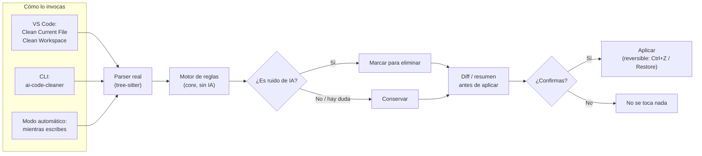

<p align="center">
  
</p>

<h1 align="center">AI Code Cleaner</h1>

Elimina los comentarios de relleno que dejan los agentes de IA (`// Verificar si el usuario existe`,
`// Devolver la respuesta`, etc.) sin tocar la lógica, los nombres ni el estilo de tu código.

> **NO MEJORES MI CÓDIGO. SOLO QUÍTALE EL RUIDO.**

Gratuito y de código abierto. Funciona 100% local — no envía tu código a ningún servicio
externo, no usa IA/LLM para decidir qué borrar (reglas deterministas), y siempre puedes
ver el diff y aceptar o rechazar antes de que se aplique un cambio.

## Cómo funciona

1. **Detecta el ruido, no el código.** Analiza tu archivo con un parser real
   ([tree-sitter](https://tree-sitter.github.io/tree-sitter/)), no con texto plano —
   así nunca confunde un `//` dentro de un string o una URL con un comentario de verdad.
2. **Aplica una regla simple y explicable:** si un comentario es corto, parafrasea
   literalmente la línea siguiente (ej. `// Devolver el usuario` justo antes de
   `return user;`) y no explica un porqué, una decisión o una limitación → se marca
   para borrar. Si hay cualquier duda razonable, **se conserva**. No hay ninguna IA
   involucrada en esta decisión — son reglas fijas y auditables (ver
   `packages/core/src/rules/redundancy.ts`).
3. **Nunca toca lógica.** Solo borra el comentario (su línea completa o su tramo
   final), nunca nombres, imports, condiciones, tipos ni formato. Si el archivo tiene
   un error de sintaxis, se abstiene por completo en vez de arriesgarse.
4. **Siempre es reversible.** Diff antes de aplicar, `Restore`/Ctrl+Z después, y el
   archivo original siempre recuperable vía Git.



**Tres formas de usarlo**, todas sobre el mismo motor (`packages/core`) — nunca hay
lógica de limpieza duplicada entre ellas:

- **VS Code**: `Clean Current File` / `Preview Changes` (con diff antes de aplicar),
  `Clean Selection`, `Restore` (deshacer), y **`Clean Workspace`** — analiza y limpia
  todo el proyecto abierto de una sola vez (pensado para instalar la extensión sobre
  un desarrollo ya avanzado hecho con IA), mostrando un resumen antes de aplicar nada.
- **Modo automático**: mientras escribes, sugiere borrar un comentario redundante
  apenas lo terminas de escribir (vía CodeLens); no borra nada por su cuenta salvo
  que actives explícitamente `aiCodeCleaner.liveMode.autoApply`.
- **CLI** (`ai-code-cleaner`): mismo motor desde terminal — un archivo, una carpeta
  completa (`.`, recorre el proyecto entero ignorando `node_modules` y similares),
  `--write`, `--check` (para CI), `--json` (reporte estructurado), `--stdin` (para
  conectarla como formatter externo en Neovim, JetBrains, Sublime, etc.).

## Estado

MVP funcional y empaquetable (ver `PROGRESS.md` para el detalle exacto por fase):
motor, extensión de VS Code (con `.vsix` instalable) y CLI ya funcionan, con pruebas
automatizadas en verde. Todavía no está publicada en el VS Code Marketplace ni en
npm — se instala generando el `.vsix`/ejecutando la CLI desde el código fuente (ver
abajo). Lo único que falta de confirmación humana: probar la extensión dentro de un
VS Code real (ver `packages/vscode/README.md`).

## Lenguajes soportados

- TypeScript / JavaScript
- Python
- Go
- Java
- C#

Arquitectura pensada para agregar más lenguajes sin duplicar lógica (ver `CLAUDE.md`).

## Instalación

Todavía no está publicada en el VS Code Marketplace ni en npm — se genera localmente
desde el código fuente. Requiere Node.js 22+.

### Extensión de VS Code

```bash
git clone https://github.com/Mateo2888/Limpiar-Mi-Codigo-.git
cd Limpiar-Mi-Codigo-
npm install
cd packages/vscode
npm run package        # genera dist/ai-code-cleaner.vsix
```

Luego en VS Code: Command Palette → **`Extensions: Install from VSIX...`** → seleccionar
`packages/vscode/dist/ai-code-cleaner.vsix`.

Para probarla sin empaquetar (modo desarrollo): abrir `packages/vscode` en VS Code y
presionar **F5** (abre un Extension Development Host con la extensión ya cargada).

### CLI

```bash
npm install && npm run build   # desde la raíz del repo
node packages/cli/dist/cli.js archivo.ts          # dry-run
node packages/cli/dist/cli.js archivo.ts --write  # aplica los cambios
```

Detalle de flags en `packages/cli/README.md`.

## Desarrollo

Ver `CLAUDE.md` para arquitectura, decisiones y comandos de verificación.

## Licencia

**Apache License 2.0** — de código abierto y gratuita, incluso para uso comercial.
En corto, te permite:

- Usar, copiar, modificar y distribuir este código libremente.
- Usarlo en proyectos privados o comerciales, sin pagar nada.
- Modificarlo y crear tu propia versión, siempre que mantengas el aviso de
  copyright y de licencia original.

A cambio, el software se ofrece **"tal cual"**, sin garantías — y si contribuyes
código a este repositorio, lo haces bajo los mismos términos.

El texto legal completo y oficial está en inglés en el archivo [`LICENSE`](LICENSE)
(las traducciones de licencias no tienen validez legal, por eso el archivo en sí
no se traduce; este resumen es solo para orientarte).
